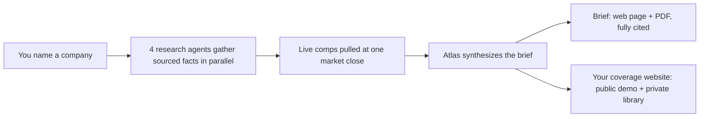

# Alfred Tools

**The analyst toolkit from the Alfred project — banker-grade research, automated.**

Alfred Tools is a growing set of tools that do an analyst's grunt work end-to-end: gather sourced
facts, pull live numbers, and ship a reviewable, fully-cited deliverable. It ships one tool today,
with more to come.

| Tool | What it does | Status |
|---|---|---|
| **Atlas** | Turns any company name or ticker into a banker-grade research brief (web page + PDF). | ✅ Available |
| _more_ | Additional analyst tools | 🚧 Planned |

Everything here follows the same rules: **public information only, every number sourced and dated,
and every output is a draft for human review** — research support, not investment advice.

---

## Atlas

**Turn any company into a banker-grade research brief, in minutes.**

Atlas is a research copilot for technology investment bankers. You type a company name; Atlas pulls
live trading comps, recent news, and earnings takeaways into a clean, fully sourced brief (a web page
and a print-ready PDF), saves it to a research library you own, and can publish that library as a
password-protected website. Every number is pulled live and dated, never written from memory.

### What you get

- **A brief per company** you could hand to an MD: business overview, comparable companies, recent
  news, earnings takeaways, a SWOT, key risks, and diligence questions — a clean web page plus a
  print-ready PDF.
- **A research library** that compounds. Every company you cover is saved, dated, and searchable.
- **A coverage website you control**: a public demo page to share, and your full library behind a password.

### How it works



Under the hood: four agents (Research · News · Transcript · Data) run in parallel, restricted to a
curated set of trusted sources. All trading multiples are pulled in a single live snapshot so every
comp shares one market-close date. A synthesis pass writes the brief, then two QA passes run on every
output — a **source-integrity audit** (live-checks every link) and a **metric-consistency audit**
(every dollar figure must tie across the brief, with its period labeled). Nothing ships unreviewed.

## Using Atlas

There are two ways in.

### 1. As a Claude Code plugin (fastest)

Install the research engine into your own Claude Code — no clone needed. Briefs land in `data-dumps/`
in whatever project you're working in.

```
/plugin marketplace add Agrimd15/alfred-tools
/plugin install atlas-research@alfred-tools
/atlas SNOW
```

See [`plugins/atlas-research/`](plugins/atlas-research) for the plugin and its README. (You'll need
Python 3.9+ and, for PDFs, local Chrome — the plugin handles the rest.)

### 2. Clone this repo (full workflow + coverage site)

Clone for the complete experience, including the publishable coverage website. Atlas runs inside
**Claude Code**, Anthropic's AI assistant for builders; setup is a one-time ~15-minute step and a
guided assistant does the hard parts.

1. Open this repo in Claude Code.
2. Type **`/setup`**. It checks your machine, helps you research your first company, and walks you
   through publishing your coverage site.

Prefer a written checklist? See **[SETUP.md](SETUP.md)**. Not technical? Hand SETUP.md to whoever sets
up your tools, then you just type company names and read the briefs.

## What's inside

| Folder | What it is |
|---|---|
| `agents/` | The four research agents + the deliverable renderer and QA audits |
| `plugins/atlas-research/` | Atlas packaged as an installable Claude Code plugin |
| `.claude-plugin/` | The marketplace manifest (this repo doubles as the plugin marketplace) |
| `site/` | Your coverage website (a public demo plus a password-protected full library) |
| `data-dumps/` | Your research library, one folder per company |
| `docs/` | Sync model, rename plan, and the plugin design record |
| `SETUP.md`, `CLAUDE.md` | The setup guide and the operating manual |

## A few ground rules

- **Public information only.** No confidential, client, or deal data belongs here.
- **Every number is sourced and dated.** Nothing is written from memory.
- **Every brief is a draft for your review.** It is research support, not investment advice.
