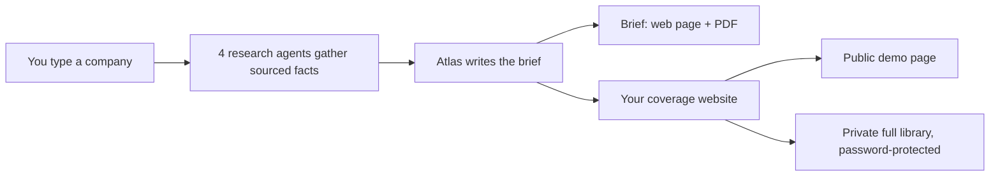

# Atlas

**Turn any company into a banker-grade research brief, in minutes.**

Atlas is a research copilot for technology investment bankers. You type a company name; Atlas pulls
live trading comps, recent news, and earnings takeaways into a clean, fully sourced brief (a web page
and a print-ready PDF), saves it to a private research library you own, and can publish that library
as a password-protected website. Every number is pulled live and dated, never written from memory.

Atlas is the first tool of the **Alfred** analyst project.

## What you get

- **A brief per company** you could hand to an MD: business overview, comparable companies, recent
  news, earnings takeaways, key risks, and diligence questions. A clean web page plus a print-ready PDF.
- **A private research library** that compounds. Every company you cover is saved, dated, and searchable.
- **A coverage website you control**: a public demo page to share, and your full library behind a password.

## How it works

## Getting started

Atlas runs inside **Claude Code**, Anthropic's AI assistant for builders. Setup is a one-time step of
about 15 minutes, and a guided assistant does the hard parts for you:

1. Open this repo in Claude Code.
2. Type **`/setup`**. It checks your machine, helps you research your first company, and walks you
   through publishing your coverage site.

Prefer a written checklist? See **[SETUP.md](SETUP.md)**. Not technical? Hand SETUP.md to whoever sets
up your tools, then you just type company names and read the briefs.

## What's inside

| Folder | What it is |
|---|---|
| `agents/` | The four research agents that gather the facts |
| `site/` | Your coverage website (a public demo plus a password-protected full library) |
| `data-dumps/` | Your research library, one folder per company (ships with 2 examples) |
| `viewer/` | An optional local app for browsing your library offline |
| `SETUP.md`, `CLAUDE.md` | The setup guide and the operating manual |

## A few ground rules

- **Public information only.** No confidential, client, or deal data belongs here.
- **Every number is sourced and dated.** Nothing is written from memory.
- **Every brief is a draft for your review.** It is research support, not investment advice.
